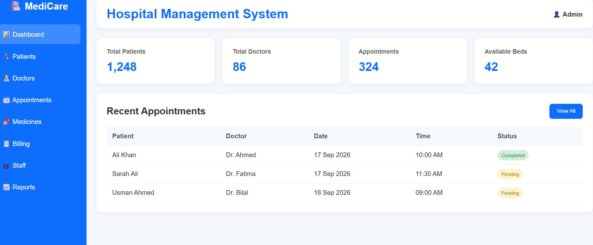

# 🏥 MediCare - Hospital Management System Dashboard

A clean, modern, and responsive static dashboard for a Hospital Management System. This project is built using pure **HTML**, **CSS**, and **JavaScript**, making it lightweight and easy to integrate into any backend system.

## ✨ Features

- **Modern UI/UX:** A clean, professional medical-themed interface using a blue and white color palette.
- **Responsive Sidebar:** Easy navigation between Dashboard, Patients, Doctors, Appointments, Medicines, Billing, Staff, and Reports.
- **Dynamic Stat Cards:** Quick overview of key metrics (Total Patients, Total Doctors, Appointments, Available Beds).
- **Recent Appointments Table:** Displays patient data, assigned doctor, date, time, and a color-coded status badge (Completed/Pending).
- **Top Navigation Bar:** Includes the system title and an Admin profile indicator.

## 🛠️ Tech Stack

- **HTML5:** Semantic structure of the web page.
- **CSS3:** Custom styling, Flexbox/Grid layouts, and responsive design.
- **JavaScript (Vanilla):** (Optional) For basic interactivity, dynamic data rendering, or future API integrations.

